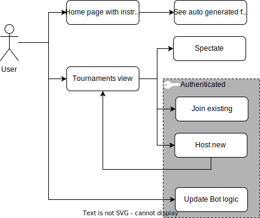
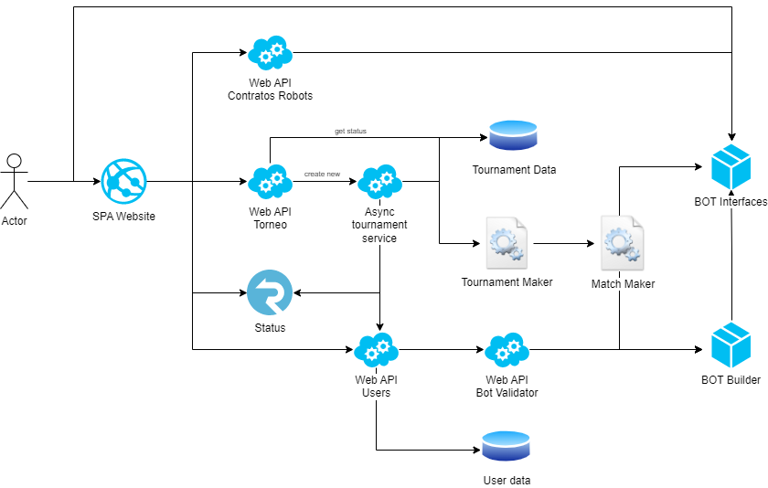

# automaton

## Objetivo
Diseñar una plataforma de aprendizaje lúdica donde poder competir programando. Para eso podemos utilizar el atiguo proyecto AutomataNET y mejorarlo:
Proyecto legacy: [https://github.com/automaton-game/legacy]

## Planificacion
Las tareas las gestionamos en proyectos GitHub: [https://github.com/orgs/automaton-game/projects/1]

## Casos de uso

## Arquitectura de componentes

## Stack tecnológico

- ***.NET*** Para desarrollar el backend, que en su mayoría serán WebApi. [https://dotnet.microsoft.com/]
- ***ReactJs*** Para el FrontEnd de todo el sitio. [https://reactjs.org/]
-*** MongoDB*** Para persistencia de datos. [https://www.mongodb.com/]
- ***SignalR*** Hosteado en la nube, y servirá para notificar eventos asincrónicos en la web. [https://dotnet.microsoft.com/en-us/apps/aspnet/signalr]
- ***Nuget Package*** Armado de packetes nuget para distribuir a los usuarios. [https://www.nuget.org/]
- ***GitHub Actions*** Para automatizar los despliegues. [https://github.com/features/actions]
- ***GitHub Pages*** Para generar documentos de presentación al proyecto. [https://pages.github.com/]
- ***Azure Portal*** Para gestionar los servicios [https://portal.azure.com/]

